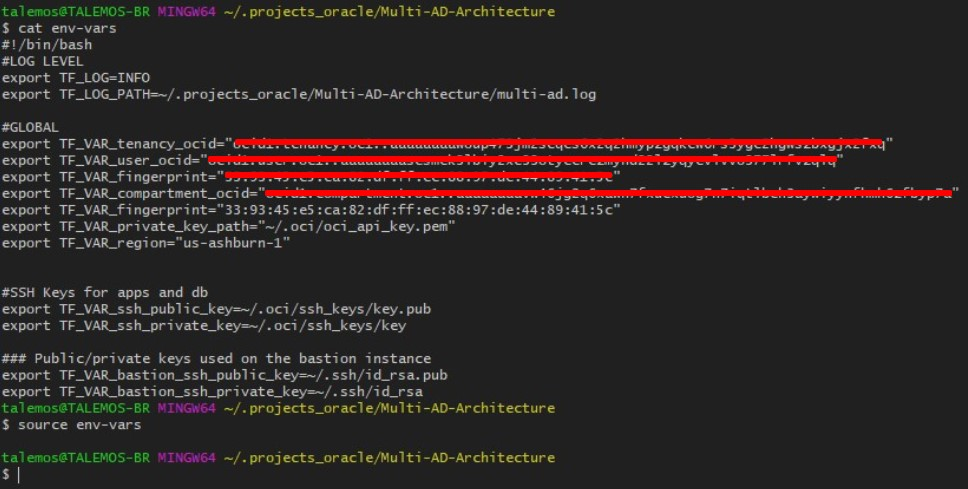
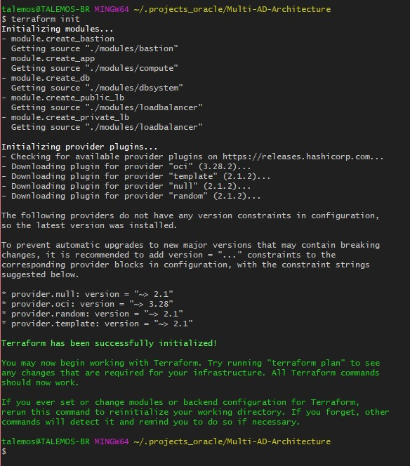
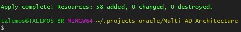

# Oracle EBS on OCI - Terraform modules for Partners

## Summary
This repository covers the terraform code for EBS on OCI, the respository is organized into two diferent architectures blueprint:

- Single AD with DR on different regions
- Multi AD with the same region

To execute the terraform script, please follow these instructions:

- [Configure your tenancy and user for terraform script](https://docs.cloud.oracle.com/iaas/Content/API/SDKDocs/terraformgetstarted.htm)
- [Export your credentials](https://www.terraform.io/docs/providers/oci/index.html)

## Oracle E-Business Suite Terraform modules structure
Each directory represents one EBS environment structure on its own, with terraform and configuration files:

- [**docs**]: Folder for document images of the Architecture
- [**modules**]: The modules directory contain all the modules required for creating Oracle Cloud Infrastructure resources.
  - [bastion]: This module is used to create bastion hosts.
  - [compute]: This module is used  to create unix and windows compute instances.
  - [dbsystem]: This module is used to create Oracle Cloud Infrastructure database system.
  - [loadbalancer]: This module is used to create Oracle Cloud Infrastructure load Balancing service.
- [**Multi-AD-Architecture**]: This is the EBS environment for Multi-AD Architecture on the same region deployment.
- [**printscreens**]: Some print screens from the terraform execution of the environments.
- [**Single-AD-DR-Architecture**]: This is the EBS environment for Single AD with DR on different region deployment.
  - [Region1]: The first active region for EBS deployment.
  - [Region2]: The DR passive region for EBS deployment.
    
### Inputs required in the environment "env-vars" file

The following inputs are required for terraform execution:

| Argument                   | Description                                                                                                                                                                                                                                                                                                                                                       |
| -------------------------- | ----------------------------------------------------------------------------------------------------------------------------------------------------------------------------------------------------------------------------------------------------------------------------------------------------------------------------------------------------------------- |
| TF_LOG | Configuration for the LOG level of terraform execution. |
| TF_LOG_PATH | Local folder path where the log is created during terraform execution. |
| TF_VAR_tenancy_ocid | Your OCI tenancy ID. |
| TF_VAR_user_ocid | Your user ID from your tenancy, this's the user that you configure to executes the terraform script. |
| TF_VAR_compartment_ocid | The OCID for the compartment on your tenancy to provision the resources. |
| TF_VAR_fingerprint | Your authentication key fingerprint that you configure on the OCI console. |
| TF_VAR_private_key_path | Path to your local directory were you have your private key file. |
| TF_VAR_region | The OCI region where you are executing the terraform script. |
| TF_VAR_ssh_public_key | The path to your local public key, that you configure on the provisioned instances on OCI tenancy for this terraform script. |
| TF_VAR_ssh_private_key | The path to your local private key, that you configure on the provisioned instances on OCI tenancy for this terraform script. |
| TF_VAR_bastion_ssh_public_key | The path to your local public key, that you configure on the provisioned the bastion instance on OCI tenancy for this terraform script. |
| TF_VAR_bastion_ssh_private_key | The path to your local private key, that you configure on the provisioned the bastion instance on OCI tenancy for this terraform script. |

#### Sample env-vars file to execute


```hcl
#!/bin/bash
#LOG LEVEL
export TF_LOG=INFO
export TF_LOG_PATH=~/.projects_oracle/Multi-AD-Architecture/multi-ad.log

#GLOBAL
export TF_VAR_tenancy_ocid="<your tenancy ocid>"
export TF_VAR_user_ocid="<your user ocid>"
export TF_VAR_compartment_ocid="<your compartment ocid>"
export TF_VAR_fingerprint="33:93:45:e5:ca:82:df:ff:ec:88:97:de:44:89:41:5c"
export TF_VAR_private_key_path="~/.oci/oci_api_key.pem"
export TF_VAR_region="us-ashburn-1"


#SSH Keys for apps and db
export TF_VAR_ssh_public_key=~/.oci/ssh_keys/key.pub
export TF_VAR_ssh_private_key=~/.oci/ssh_keys/key

### Public/private keys used on the bastion instance
export TF_VAR_bastion_ssh_public_key=~/.ssh/id_rsa.pub
export TF_VAR_bastion_ssh_private_key=~/.ssh/id_rsa
```
### Inputs required in the terraform.tfvars file

The following inputs are required for terraform modules:

| Argument                   | Description                                                                                                                                                                                                                                                                                                                                                       |
| -------------------------- | ----------------------------------------------------------------------------------------------------------------------------------------------------------------------------------------------------------------------------------------------------------------------------------------------------------------------------------------------------------------- |
| AD                         | Availability Domain for Oracle E-Business Suite Deployment. This variable drives the Oracle E-Business Suite architecture to be deployed. Setting AD = ["1"] deploys infrastructure in single availability domain (Availabilty domain 1 of the tenancy in this case) and AD = ["1","2"] deploys infrastructure in multiple ADs (Availability domains 1 and 2 of the tenancy in this case). |
| vcn_cidr                   | CIDR block of the VCN (Virtual Cloud Network) to be created.                                                                                                                                                                                                      |
| bastion_subnet_cidr_block  | CIDR block of the sub network where bastion host instance is created. |
| app_subnet_cidr_block      | CIDR block of the sub network where EBS application servers instances is created. |
| public_lb_subnet_cidr_block | CIDR block of the sub network where public load balancer is created. |
| private_lb_subnet_cidr_block | CIDR block of the sub network where private load balancer is created. |
| database_subnet_cidr_block | CIDR block of the sub network where EBS database is created. |
| filestorage_subnet_cidr_block | CIDR block of the sub network where file storage is created. |
| backup_subnet_cidr_block | CIDR block of the hexadata backup sub network is created. |
| onpremises_network_cidr_block | CIDR block of the on-premises network to access EBS using the private load balancer. | 
| vcn_dns_label              | DNS Label of the VCN (Virtual Cloud Network) to be created.                                                                                                                                                                                                                                                                                                                               |
| linux_os_version           | Operating system version of Oracle Linux for compute instances. The terraform module for compute instances always pick up the latest image available for the chosen Oracle Linux version in the region.                                                                                                                        |
| timezone                   | Timezone of compute instances.                                                                                                                                                                                                                                                                                                                                  |
| bastion_user               | User name to log in to bastion host.                                                                                                                                                                                                                                                                                                                              |
| compute_boot_volume_size_in_gb | Size of boot volume in gb for compute instance.                                                                                                                                                                                                                                                                                                               |
| compute_instance_user          | User name to log in to compute instance.                                                                                                                                                                                                                                                                                                                      |
| ebs_env_prefix                 | Environment prefix to define names of Oracle Cloud infrastructure resources.                                                                                                                                                                                                                                                                                                                   |
| ebs_app_instance_count     | Number of Oracle E-Business suite application instances to be created. For single availability domain architecture, all application instances will be created in the chosen availability domain. For multiple availability domain architetcure, all application instances will be distributed in round robin fashion across the chosen availability domains.                                                                   |
| ebs_app_instance_shape         | Shape of application instance. For more information on available shapes, see [VM Shapes](https://docs.cloud.oracle.com/iaas/Content/Compute/References/computeshapes.htm?TocPath=Services#vmshapes)                                                                                                                                                               |
| ebs_app_instance_listen_port   | Port on which Oracle E-Business Suite application instance will listen and receive requests from Oracle Cloud Infrastructure Load Balancing Service.                                                                                                                                                                                                                                                                                             |
| ebs_fss_primary_mount_path | Mount path for Oracle E-Business Suite application primary filesystem. For example /u01/install/APPS.                                                                                                                                                                                                                                                                                     |
| ebs_fss_limit_size_in_gb | Soft upper limit for Oracle E-Business Suite application primary filesystem. This value is defined just to set an upper soft size limit visible to Oracle E-Business Installation tools. It does not restrict storage size of File Storage Service.                                                                                                                                                                                                                                                                                     |
| db_edition                 | Edition of database.     
| db_license_model           | Licensing model for database.                                                                                                                                                                                                                                                                                                                                     |
| db_version                 | Version of database.                                                                                                                                                                                                                                                                                                                                              |
| db_node_count              | Number of database nodes. For single instance database, this parameter should be 1 and for Real Application Cluster Database, this parameter should be set to 2.                                                                                                                                                                                                  |
| db_instance_shape          | Shape of Database nodes. For RAC, the minimum required shape is VMStandard1.2.                                                                                                                                                                                                                                                                                    |  
| db_name                    | Name of Database Container.                                                                                                                                                                                                                                                                                                                                                    |
| db_size_in_gb              | Size of database in gb. For more information, see [Oracle Cloud Infrastructure Images](https://docs.cloud.oracle.com/iaas/images/)                                                                                                                                                                                                                                      |
| db_admin_password          | Database administration password (sys password).                                                                                                                                                                                                                                                                                                                  |  
| db_characterset            | Characterset of database.                                                                                                                                                                                                                                                                                                                                         |
| db_nls_characterset        | National Characterset of database.                                                                                                                                                                                                                                                                                                                                     |                                                                                                                                                                                                                                                                                                                                     |
| db_pdb_name                | Starter Pluggable database name.                                                                                                                                                                                                                                                                                                                                          |
| load_balancer_hostname     | Hostname of the load balancer.                                                                                                                                                                                                                                                                                                                                    |
| load_balancer_shape        | Shape of the load balancer.                                                                                                                                                                                                                                                                                                                                       |
| load_balancer_listen_port  | Listen port of the load balancer.                                                                                                                                                                                                                                                                                                                                 |

##### Sample terraform.tfvars file to create Oracle E-Business Suite infrastructure in multiple availability domain architecture

```hcl
# AD (Availability Domain to use for creating EBS infrastructure) 
AD = ["1","2"]

# CIDR block of VCN to be created
vcn_cidr = "10.0.0.0/16"

#subnet cidr block
bastion_subnet_cidr_block = "10.0.4.0/24"
app_subnet_cidr_block = "10.0.3.0/24"
public_lb_subnet_cidr_block = "10.0.5.0/24"
private_lb_subnet_cidr_block = "10.0.6.0/24"
database_subnet_cidr_block = "10.0.1.0/24"
filestorage_subnet_cidr_block = "10.0.7.0/24"
backup_subnet_cidr_block = "10.0.2.0/24"

#customer onpremises DC network
onpremises_network_cidr_block = "192.168.10.0/24"

# DNS label of VCN to be created
vcn_dns_label = "ebsvcn"

# Operating system version to be used for application instances
linux_os_version = "7.6"

# Timezone of compute instance
timezone = "America/New_York"

# Login user for bastion host
bastion_user = "opc"

# Size of boot volume (in gb) of application instances
compute_boot_volume_size_in_gb = "100"

# Login user for compute instance
compute_instance_user = "opc"

#Environment prefix to define name of resources
ebs_env_prefix = "ebsenv"

#Environment prefix to define name of DB
db_hostname_prefix = "dbdemo"

# Number of application instances to be created
ebs_app_instance_count = "6"

# Shape of app instance
ebs_app_instance_shape = "VM.Standard2.2"

# Listen port of the application instance
ebs_app_instance_listen_port = "8000"

# Mount path for application filesystem
ebs_fss_primary_mount_path = "/u01/install/APPS"

# Set filesystem limit
ebs_fss_limit_size_in_gb = "500"

# Datbase Edition
db_edition = "ENTERPRISE_EDITION_EXTREME_PERFORMANCE"

# Licensing model for database
db_license_model = "LICENSE_INCLUDED"

# Database version
db_version = "18.0.0.0"

# Number of database nodes
db_node_count = "1"

#Shape of Database nodes
db_instance_shape = "VM.Standard2.4"

#Database name
db_name = "EBSCDB"

#Size of Database
db_size_in_gb = "256"

# Database administration (sys) password
db_admin_password = "<your password>"

# Characterset of database
db_characterset = "AL32UTF8"

# National Characterset of database
db_nls_characterset = "AL16UTF16"

# Pluggable database name
db_pdb_name = "DUMMYPDB"

# Shape of Load Balancer
load_balancer_shape = "100Mbps"

#Listen port of load balancer
load_balancer_listen_port = "8000"

#Public Hostname of Load Balancer
public_load_balancer_hostname = "pub.ebs.example.com"

#Private Hostname of Load Balancer
private_load_balancer_hostname = "pri.ebs.example.com"
```
### How to execute
To execute the terraform code, configure the variable files as described above, save your changes and load the environment variable "source env-vars" before calling any terraform command, this'll prevent you from imputing variables manually on the console.

<p align="center">
  
</p>

 After loading the variables, you can perform the "terraform init" command, to load the modules and OCI terraform provider.
 
 <p align="center">
  
</p>

After executing terraform init, you can perform "terraform apply" to create your environment, before submitting your environment, please review all changes on the OCI tenant that you are requesting to create, make sure you have the necessary service limits to create all the infrastructure and instances on your tenant.

<p align="center">
  
</p>

This sample created 58 resources on OCI tenant.
